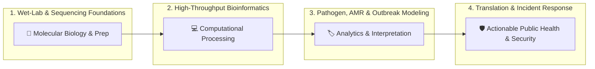

<p align="center">
  
</p>

<p align="center">
  <a href="#-table-of-contents"></a>
  <a href="#-table-of-contents"></a>
  <a href="LICENSE"></a>
  <a href="CONTRIBUTING.md"></a>
  
</p>

---

## 🌟 Overview

Welcome to the **Awesome Metagenomic Biosurveillance Analyst Interview Q&A** repository! 🧬🔬

This repository is a comprehensive, production-grade collection of technical interview questions, answers, architectural design scenarios, and troubleshooting case studies tailored for **Metagenomic Biosurveillance Analysts**, **Computational Pathogen Biologists**, **Bioinformaticians**, and **Public Health Genomic Data Scientists**.

Whether you are preparing for interviews at public health institutions (e.g., CDC, UKHSA, WHO), biosecurity defense labs, clinical mNGS diagnostic centers, or environmental sequencing initiatives, this repository provides deep, rigorous, and actionable insights.

---

## 📑 Table of Contents

- [🌟 Overview](#-overview)
- [🧭 Core Curriculum & Topic Modules](#-core-curriculum--topic-modules)
  - [01. 🧪 Metagenomic Sequencing Platforms & Library Prep](topics/01-Metagenomic-Sequencing-Platforms-Library-Prep.md)
  - [02. 💻 Bioinformatic Pipelines & Pathogen Detection](topics/02-Bioinformatic-Pipelines-Pathogen-Detection.md)
  - [03. 🏷️ Taxonomic Classification & Reference Databases](topics/03-Taxonomic-Classification-Reference-Databases.md)
  - [04. 💊 Antimicrobial Resistance (AMR) Gene Surveillance](topics/04-AMR-Gene-Surveillance.md)
  - [05. 🚰 Wastewater & Environmental Biosurveillance (WBE)](topics/05-Wastewater-Environmental-Surveillance.md)
  - [06. 🔍 Novel Pathogen Discovery & Characterization](topics/06-Novel-Pathogen-Discovery-Characterization.md)
  - [07. 🌳 Phylogenomics & Outbreak Investigation](topics/07-Phylogenomics-Outbreak-Investigation.md)
  - [08. 🏥 Clinical Metagenomics & Diagnostic Applications](topics/08-Clinical-Metagenomics-Diagnostic-Applications.md)
  - [09. 🤖 ML, Anomaly Detection & Outbreak Forecasting](topics/09-ML-Anomaly-Detection-Outbreak-Forecasting.md)
  - [10. 🛡️ Biosecurity, Data Governance & Dual-Use Ethics](topics/10-Biosecurity-Data-Governance-Ethics.md)
  - [11. 🛠️ Troubleshooting & Scenario-Based Case Studies](topics/11-Troubleshooting-Case-Studies.md)
  - [12. 🌐 Field Trajectory & Public Health Integration](topics/12-Field-Trajectory-Public-Health-Integration.md)
- [📚 Supplementary Documentation & Study Guides](#-supplementary-documentation--study-guides)
- [🎯 Interview Preparation Strategy & Framework](#-interview-preparation-strategy--framework)
- [🧰 Metagenomic Biosurveillance Tech Stack](#-metagenomic-biosurveillance-tech-stack)
- [🤝 Contributing](#-contributing)
- [📜 License](#-license)

---

## 🧭 Core Curriculum & Topic Modules

| # | Module | Core Focus Areas | Key Keywords |
|---|---|---|---|
| **01** | [🧪 Metagenomic Sequencing Platforms & Library Prep](topics/01-Metagenomic-Sequencing-Platforms-Library-Prep.md) | Short-read vs long-read (Illumina vs ONT/PacBio), host DNA depletion, low-input library prep, target enrichment (hybrid capture vs amplicon). | `Host Depletion` `ONT Adaptive Sampling` `Hybrid Capture` `UMIs` |
| **02** | [💻 Bioinformatic Pipelines & Pathogen Detection](topics/02-Bioinformatic-Pipelines-Pathogen-Detection.md) | Read pre-processing, QC, host de-hosting, de novo metagenomic assembly, pipeline orchestration (Nextflow/Snakemake/WDL), containerization. | `Fastp` `Bowtie2/Minimap2` `MEGAHIT` `Nextflow nf-core` |
| **03** | [🏷️ Taxonomic Classification & Reference Databases](topics/03-Taxonomic-Classification-Reference-Databases.md) | K-mer exact match, pseudo-alignment, marker-gene vs translation-based classifiers, database curation (RefSeq, GenBank, GTDB), index memory optimization. | `Kraken2/Bracken` `Centrifuge` `MetaPhlAn` `DIAMOND` |
| **04** | [💊 AMR Gene Surveillance](topics/04-AMR-Gene-Surveillance.md) | Resistance gene identification (CARD, ResFinder, MEGARes), point mutations vs acquired genes, plasmid & mobile genetic element (MGE) contextualization. | `RGI / CARD` `AMRFinderPlus` `PlasmidFinder` `Integrons` |
| **05** | [🚰 Wastewater & Environmental Surveillance](topics/05-Wastewater-Environmental-Surveillance.md) | Wastewater-based epidemiology (WBE), mixed-lineage deconvolution, signal normalization (PMMoV, flow rate), PCR inhibitors & degradation. | `Freyja` `PMMoV` `Spillover Detection` `Air/Soil Sampling` |
| **06** | [🔍 Novel Pathogen Discovery](topics/06-Novel-Pathogen-Discovery-Characterization.md) | Identifying divergent and uncharacterized viruses/bacteria, HMM profiles, protein fold comparison (AlphaFold/ESMfold), viral dark matter analysis. | `HMMER` `Foldseek` `Viral Dark Matter` `Crown-group Phyla` |
| **07** | [🌳 Phylogenomics & Outbreak Investigation](topics/07-Phylogenomics-Outbreak-Investigation.md) | Maximum likelihood & Bayesian phylogenetics, molecular clock calibration, transmission tree inference, genomic epidemiology in public health. | `IQ-TREE` `Nextstrain / Augur` `BEAST` `Transmission Chains` |
| **08** | [🏥 Clinical Metagenomics & Diagnostics](topics/08-Clinical-Metagenomics-Diagnostic-Applications.md) | Diagnostic yield, clinical validation (LOD, specificity, sensitivity), background kit contamination (kitome), CLIA/CAP regulatory requirements. | `CLIA/CAP` `Kitome / Splashome` `Limit of Detection` `Spike-ins` |
| **09** | [🤖 ML & Anomaly Detection](topics/09-ML-Anomaly-Detection-Outbreak-Forecasting.md) | Sequence embedding models, outlier detection in baseline taxonomic profiles, deep learning for AMR prediction, early-warning anomaly detection. | `Isolation Forest` `ESM / DNABERT` `Nowcasting` `Time-Series Anomaly` |
| **10** | [🛡️ Biosecurity & Data Governance](topics/10-Biosecurity-Data-Governance-Ethics.md) | Select agent screening, dual-use research of concern (DURC), pathogen synthesis screening, human privacy removal, Nagoya Protocol & sample sovereignty. | `DURC` `Screening Protocols` `Human De-identification` `Nagoya Protocol` |
| **11** | [🛠️ Troubleshooting & Scenario Case Studies](topics/11-Troubleshooting-Case-Studies.md) | Real-world problem solving: resolving index hopping, diagnosing GC bias, handling degraded field samples, investigating conflicting taxonomic calls. | `Index Hopping` `Batch Effects` `Chimeric Contigs` `Root-Cause Analysis` |
| **12** | [🌐 Field Trajectory & Public Health Integration](topics/12-Field-Trajectory-Public-Health-Integration.md) | Global biosurveillance networks (WHO, GISAID, Pathogen Genomics Initiative), real-time edge sequencing, cloud architectures, policy integration. | `One Health` `Edge Sequencing` `GISAID / NCBI SRA` `Policy Decision Support` |

---

## 📚 Supplementary Documentation & Study Guides

Explore our specialized docs to streamline your interview study roadmap:

- 🗺️ **[Career & Preparation Roadmap](docs/roadmap.md)**: Stage-by-stage learning guide from entry-level bioinformatician to principal biosurveillance scientist.
- 📖 **[Comprehensive Biosurveillance Glossary](docs/glossary.md)**: Clear definitions for 100+ key terms across genomics, epidemiology, biosecurity, and machine learning.
- 🔗 **[Curated Resources & Datasets](docs/resources.md)**: Benchmark datasets, open-source pipelines, reference databases, seminal papers, and official agency guidelines.

---

## 🎯 Interview Preparation Strategy & Framework



### 💡 The 4-Pillar Biosurveillance Interview Rubric

1. **🔬 Wet-Lab & Sample Context**: Explain how collection matrices (wastewater, BAL, swab, tissue), degradation, and library choices affect downstream sequencing metrics.
2. **⚙️ Algorithmic & Pipeline Proficiency**: Justify tool selection (e.g., k-mer classification vs. assembly-first alignment) considering compute, memory, sensitivity, and false-positive risk.
3. **📊 Statistical & Epidemiological Rigor**: Interpret lineage frequencies, baseline anomalies, limit of detection ($LoD$), and growth rates with epidemiological context.
4. **🛡️ Biosecurity, Compliance & Communication**: Translate complex genomic findings into clear, responsible recommendations for clinicians, epidemiologists, and policy stakeholders.

---

## 🧰 Metagenomic Biosurveillance Tech Stack

```
┌─────────────────────────────────────────────────────────────────────────────┐
│                      METAGENOMIC BIOSURVEILLANCE PIPELINE                   │
├─────────────────┬─────────────────┬────────────────────┬────────────────────┤
│  Raw QC & Clean │ Host Depletion  │ Taxonomic Profile  │ Assembly & Variants│
├─────────────────┼─────────────────┼────────────────────┼────────────────────┤
│  • FastQC       │  • Bowtie2      │  • Kraken2/Bracken │  • MEGAHIT         │
│  • fastp        │  • Minimap2     │  • Centrifuge      │  • metaSPAdes      │
│  • Porechop     │  • BMTagger     │  • MetaPhlAn       │  • Medaka / Clair3 │
│  • NanoPlot     │  • Hostile      │  • DIAMOND / MEGAN │  • FreeBayes       │
├─────────────────┴─────────────────┴────────────────────┴────────────────────┤
│                 AMR, VIRULENCE & ADVANCED DISCOVERY TOOLS                   │
├─────────────────┬─────────────────┬────────────────────┬────────────────────┤
│  • RGI / CARD   │  • AMRFinder    │  • VirSorter2      │  • CheckV / CheckM │
│  • ResFinder    │  • MobileElement│  • Foldseek        │  • Freyja (WBE)    │
├─────────────────┴─────────────────┴────────────────────┴────────────────────┤
│                       WORKFLOW & INFRASTRUCTURE                             │
├───────────────────────────────────┬─────────────────────────────────────────┤
│  • Nextflow (nf-core/mag, viralrecon) • Snakemake                           │
│  • Docker / Singularity Containers│  • AWS HealthOmics / GCP Life Sciences  │
└───────────────────────────────────┴─────────────────────────────────────────┘
```

---

## 🤝 Contributing

Contributions, question suggestions, case study additions, and clarifications are warmly welcome! 

1. Review [CONTRIBUTING.md](CONTRIBUTING.md) for contribution rules, formatting conventions, and branch guidelines.
2. Fork the repository & create a feature branch (`git checkout -b feature/new-case-study`).
3. Commit your changes and open a pull request!

---

## 📜 License

Distributed under the **MIT License**. See [`LICENSE`](LICENSE) for complete details.

---

<p align="center">
  <sub>Built with 🧬 for the computational biology, public health genomics, and biosecurity research communities.</sub>
</p>
